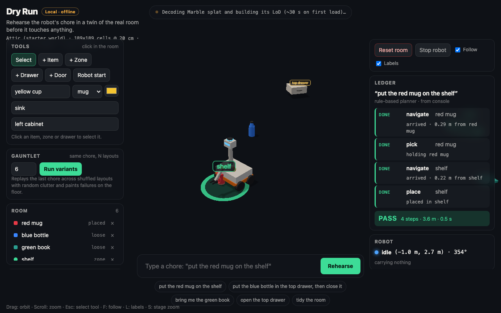
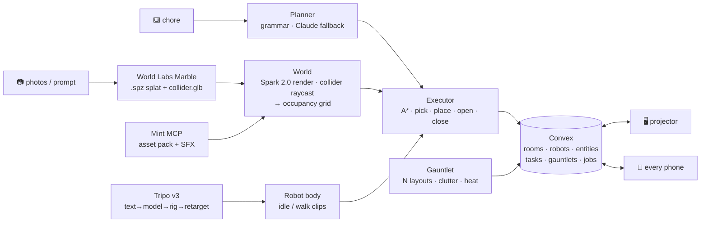

<div align="center">

# 🤖 Dry Run

### **No robot should touch a room it hasn't rehearsed in.**

Photograph a room → get a **World Labs Marble twin** → tap the drawers and doors that matter → type a chore in plain English →
a **Tripo robot** rehearses it, every pick / place / drawer-open flipping `queued → doing → done` on the projector **and on every phone at the same moment** via **Convex** →
then **Gauntlet** replays the chore across N shuffled, cluttered layouts and paints where the robot got stuck on the floor.

[**▶ Live demo**](https://vnmoorthy.github.io/dry-run/) · [**📱 Phone ledger**](https://vnmoorthy.github.io/dry-run/ledger.html?room=demo) · [**🏗 Architecture**](docs/ARCHITECTURE.md) · [**🎬 2-minute demo script**](docs/DEMO.md) · [**📝 Submission**](docs/SUBMISSION.md)

[](https://vnmoorthy.github.io/dry-run/)
[](tests/sim.test.ts)
[](tsconfig.json)
[](LICENSE)

[](#-why-this-matters)
[](#-sponsors-what-each-one-does-in-the-loop)
[](#-sponsors-what-each-one-does-in-the-loop)
[](#-sponsors-what-each-one-does-in-the-loop)
[](#-sponsors-what-each-one-does-in-the-loop)
[](package.json)
[](package.json)
[](vite.config.ts)

*Built in one day at the **Spatial Intelligence + Generative 3D Hackathon** — Founders, Inc. · Fort Mason, San Francisco · Sept 5, 2026*

<a href="https://vnmoorthy.github.io/dry-run/"></a>

<sub>Captured headlessly from the live URL: <code>put the red mug on the shelf</code> → <b>PASS · 4 steps · 3.6 m</b>. Every ledger row you see is a store mutation the phones receive too.</sub>

</div>

---

## ⚡ 30-second tour

```text
> put the blue bottle in the top drawer, then close it

 ① navigate → blue bottle          done · arrived 0.28 m
 ② pick      blue bottle           done
 ③ navigate → top drawer           done · arrived 0.31 m
 ④ open      top drawer            done · prismatic 0 → 0.42
 ⑤ place     blue bottle           done · in top drawer
 ⑥ navigate → top drawer           done
 ⑦ close     top drawer            done · prismatic 0.42 → 0

 ✅ PASS · 6.8 m · 14.2 s            — identical on the projector and on every phone
```

Then hit **Run variants**:

```text
 Gauntlet · "put the blue bottle in the top drawer, then close it" · 6 layouts
 ■ as-is       PASS
 ■ shuffle #1  PASS
 ■ shuffle #2  FAIL  blocked by clutter box 2, 0.8 m from top drawer     ← red disc on the floor
 ■ shuffle #3  PASS
 ■ shuffle #4  FAIL  no standing room within 0.9 m of shelf
 ■ shuffle #5  PASS
 4 / 6 · click any tile to replay that layout in 3D
```

**One interaction:** type a chore. **One visible outcome:** the robot does it (or fails with a reason), and the ledger on your phone agrees with the projector.

---

## 🎯 Why this matters

Home robots don't fail at manipulation research; they fail in *your* kitchen. Every customer room is a new evaluation
environment, and today building a sim per site takes days of hand work. Dry Run collapses that to **a phone camera and
a sentence**: the twin comes from photos, the affordances come from three taps, and the chore is rehearsed before a real
robot ever moves. The simulator is now a phone camera; the bottleneck is what the robot *decides to do* in your room.
Rehearsal, not training, is the product.

---

## 🏗 Architecture at a glance



Full diagrams — sequence of a chore, executor state machine, grid/A\*, Gauntlet, Convex ER schema, sponsor pipeline — live in
**[`docs/ARCHITECTURE.md`](docs/ARCHITECTURE.md)**.

**Design rules that make it robust on a projector:**

- **The store is the single source of truth.** `LocalStore` (offline: `localStorage` + `BroadcastChannel`) and `ConvexStore` (live) share one interface; the projector and every phone render from the same subscription.
- **Only the projector tab writes robot pose and step transitions.** Phones are viewers that can submit chores.
- **Two Convex queries, not one.** The 4 Hz robot heartbeat lives in its own `robots` table so it never re-runs the big room query on every phone.
- **Deterministic sim.** `tick(dt)` is sub-stepped at ≤ 1/50 s; Gauntlet layouts are seeded; `dryrun.fastForward(20)` advances 20 s in the console without frames.
- **Refresh-proof.** Reload mid-chore: the room, ledger and heat return from the store, a held item is set down, the chore re-queues and resumes.

---

## 🧩 Sponsors: what each one does in the loop

| Sponsor | Role | Where |
| --- | --- | --- |
| **World Labs** | **The room.** A Marble world (`.spz` Gaussian splat) rendered with **Spark 2.0**; its **collider mesh** is raycast into the occupancy grid the robot plans on. Text or 4–8 phone photos → `worlds:generate` → `operations` → `worlds/{id}`. | `scripts/worldlabs-generate.mjs` · `convex/worldlabs.ts` · `src/world/world.ts` |
| **Tripo** | **The robot.** text-to-model (P1, game-ready) → **rig-check** → **auto-rig** → **retarget** `preset:idle` + `preset:walk` → one animated GLB. Props via `--prop`. Procedural mobile manipulator (2-link IK arm) when no key is present. | `scripts/tripo-robot.mjs` · `convex/tripo.ts` · `src/robot/robot.ts` |
| **Mint** | **The stuff in the room.** Claude Code + **Mint MCP** generates the household **asset pack** and SFX ("the agent stocked the room"); `mint-sync` pulls artifacts into `public/assets`; `convex/mint.ts` is the live generation path. | `docs/MINT.md` · `scripts/mint-sync.mjs` · `convex/mint.ts` |
| **Convex** | **The truth.** Entities, robot pose, tasks with per-step status, gauntlets and failure heat are reactive queries; every step is a mutation; sponsor generation jobs run `queued → generating → downloading → ready`. Optional Claude planner as an action. | `convex/schema.ts` · `convex/room.ts` · `src/data/store.ts` |

The **Receipts** panel prints each asset's provider, model and ids on screen, so every sponsor's contribution is pointable during the demo.

---

## 🔁 The loop

1. **Twin.** The world loads (starter attic, or your Marble world from `public/assets/manifest.json`). The collider is raycast on a 0.5-unit grid → free / blocked cells, floor height, drivable area.
2. **Handles.** **+ Drawer** / **+ Door** on any wall or cabinet face mounts an articulated fixture (prismatic slide / revolute hinge). **+ Item** and **+ Zone** drop objects and targets on any flat surface. Everything is a row in the store.
3. **Chore.** Type it. The planner (rule-based grammar, or Claude via Convex) emits steps. The executor drives the robot: A\* on the grid, string-pulled path, two-link arm reach, attach/detach, joint animation. Every step flips in the ledger with a note (`arrived · 0.31 m from top drawer`).
4. **Verdict.** `PASS` with distance and time, or `FAIL` with the reason (`blocked by clutter at (1.2 m, 3.4 m)`, `top drawer is closed`, `no standing room within 0.9 m of shelf`).
5. **Gauntlet.** **Run variants** replays the last chore headlessly across N layouts (as-is, then items shuffled to reachable cells + random clutter). Tiles flip green/red with reasons; failure points become red discs on the floor; click a tile to replay that layout in 3D.
6. **Second screen.** Scan the QR: the phone ledger shows live steps, the "Up next" queue, a DPR-correct top-down map, Gauntlet tiles and history — and can submit chores.

### Chores that work today

```text
put the red mug on the shelf
put the blue bottle in the top drawer, then close it        # 7 steps incl. a prismatic joint
bring me the green book  →  put it on the table               # carry-over between chores (pronoun)
put the red mug and the blue bottle on the shelf              # conjunction
open the top drawer, put the mug in it and close it           # pronouns + fixture state across clauses
grab the bottle
open the cabinet door                                         # revolute joint
tidy the shelf
```

Ambiguity is a first-class outcome: `put the mug on the shelf` with two mugs fails with `Which one: red mug, blue mug?`.

---

## 🚀 Run it

```bash
npm install
npm run dev            # http://localhost:5173  (offline mode: badge "Local · offline")
```

Open `http://localhost:5173/ledger.html?room=demo` in a second tab — that's the phone view. In offline mode it syncs across tabs of one browser; go live to sync real phones:

```bash
npx convex dev         # creates a deployment, writes .env.local with VITE_CONVEX_URL, regenerates convex/_generated
npm run dev            # badge says "Convex · live"; the QR works on any phone
```

**Quality gates (all green):**

```bash
npm test                          # 16 simulation tests: A*, planner grammar, Gauntlet determinism, LLM plan parsing
npm run typecheck                 # tsc for src/
npx tsc -p convex/tsconfig.json   # tsc for convex/
npm run build                     # vite build → dist/ (index.html + ledger.html)
```

**Deploy:**

```bash
# GitHub Pages (this repo's live demo)
VITE_BASE=/dry-run/ npm run build && push dist/ to the gh-pages branch

# Netlify / Vercel with Convex live
npx convex deploy --cmd 'npm run build'
npx convex env set WORLDLABS_API_KEY ... --prod
npx convex env set TRIPO_API_KEY ...      --prod
npx convex env set MINT_API_KEY ...       --prod
npx convex env set ANTHROPIC_API_KEY ...  --prod   # optional LLM planner
```

URL flags: `?room=<slug>` · `?local=1` (force offline) · `?stage=1` (bigger HUD for projectors). Keys: `Esc` select · `F` follow cam · `L` labels · `S` stage zoom.

<details>
<summary><b>Browser console debug handle</b></summary>

```js
dryrun.fastForward(20)      // advance the simulation 20 s without waiting for frames
dryrun.store.getState()     // the room
dryrun.store.submitTask('put the red mug on the shelf', 'console')
dryrun.executor.abort()     // Stop robot (releases the held item)
dryrun.world.grid           // occupancy grid {cols, rows, cell, floorY, cells: Uint8Array 0 free / 1 blocked / 2 void}
```

</details>

---

## 🧪 Bring your own room, robot and props

```bash
export WORLDLABS_API_KEY=...   # platform.worldlabs.ai
node scripts/worldlabs-generate.mjs --images IMG_1.jpg IMG_2.jpg IMG_3.jpg IMG_4.jpg --name "Fort Mason lounge"
#   same aspect ratio, 30–40 % overlap; or --prompt "..." ; --model marble-1.0-draft for 20-second iterations

export TRIPO_API_KEY=tsk_...
node scripts/tripo-robot.mjs                                    # rigged + animated robot.glb
node scripts/tripo-robot.mjs --prop "ceramic coffee mug" --key mug

# Mint: docs/MINT.md (Claude Code + Mint MCP asset pack of household items + 4 SFX), then
node scripts/mint-sync.mjs --from mint-assets.json
```

Every script writes `public/assets/manifest.json`; the app reads it on boot and the Receipts panel shows every id. Keys are **server-side only** — Convex env or the shell for `scripts/`; nothing under `src/` or `public/` ever sees one.

---

## 📁 Repository layout

```
src/
  sim/        types · grid (rasterize, A*, smoothing) · planner (grammar) · evaluate (Gauntlet) · executor (state machine)
  world/      world (Spark splat + collider + grid) · props (items, drawers, doors, zones, labels, heat)
  robot/      procedural mobile manipulator (2-link IK) + Tripo GLB body with idle/walk clips
  data/       store: LocalStore | ConvexStore behind one interface
  app/        room view (store → three.js), seed, sfx
  ui/         projector HUD, phone ledger
convex/       schema · room / entities / tasks / gauntlets / robot / jobs · planner (Claude) · worldlabs · tripo · mint actions
scripts/      worldlabs-generate.mjs · tripo-robot.mjs · mint-sync.mjs → public/assets/manifest.json
tests/        node --test: A*, planner grammar, Gauntlet determinism
docs/         ARCHITECTURE · DEMO · SUBMISSION · MINT · BUILD_LOG
```

---

## 🧭 Honest scope

- The twin is a **kinematic** rehearsal (paths, reach, articulation state), not a physics simulation. It answers *"can the robot do this chore in this room, and where does it fail?"* — the pre-flight, not the policy.
- Splats are static; items, fixtures and the robot are meshes over the splat with the Marble collider as ground truth (the same pattern as World Labs' own ICARE / Robot Roommates demos).
- The live demo runs on the **starter attic world** (from [icurtis1/third-person-controller-splat](https://github.com/icurtis1/third-person-controller-splat), MIT, disclosed) with the procedural robot; the World Labs / Tripo / Mint pipelines are implemented against the live API docs and swap in through `public/assets/manifest.json` the moment keys are present. Only the character-controller *world files* were reused — Dry Run's robot plans on a grid.

## 🗺 Roadmap

- [ ] Export an approved rehearsal as a task spec a real robot stack consumes (ROS 2 action list)
- [ ] **Shift** — warehouse fleet re-routing with a picks/hour meter (multi-robot Gauntlet)
- [ ] Convex Agent NPC ("Foreman") whose tools move the robot and re-stock the room
- [ ] SplatEdit carve where a fixture is mounted; USDZ export for AR Quick Look on the phone
- [ ] Judges' phones as sim workers: each phone runs Gauntlet variants for a different room ("digital cousins")

## 📚 Docs

- [`docs/ARCHITECTURE.md`](docs/ARCHITECTURE.md) — system, data flow, sequence, state machine, schema, sponsor pipeline
- [`docs/DEMO.md`](docs/DEMO.md) — the two-minute script, reset and fallback plan
- [`docs/SUBMISSION.md`](docs/SUBMISSION.md) — the submission text
- [`docs/MINT.md`](docs/MINT.md) — the Mint MCP workflow for stocking the room
- [`docs/BUILD_LOG.md`](docs/BUILD_LOG.md) — disclosed starters and build timeline
- [`HANDOVER.md`](HANDOVER.md) — everything an assistant or teammate needs to continue

<div align="center">

**MIT** · built by [@vnmoorthy](https://github.com/vnmoorthy) · *"the simulator is now a phone camera"*

</div>
