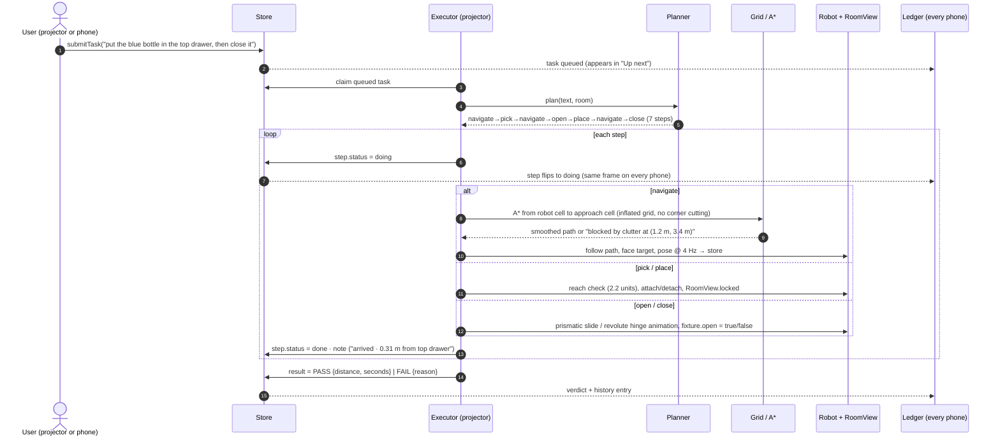
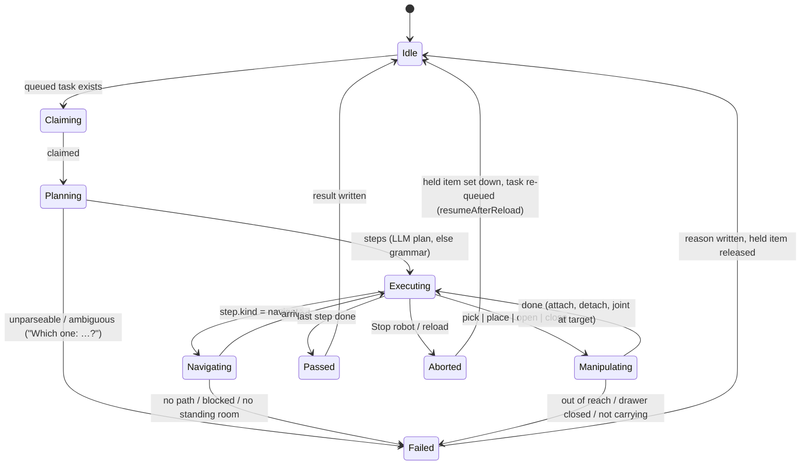
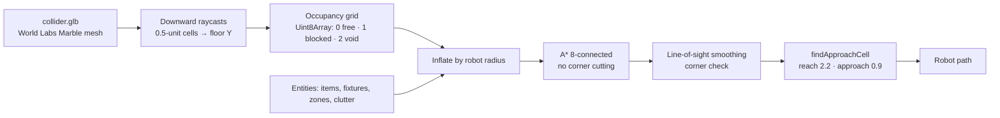
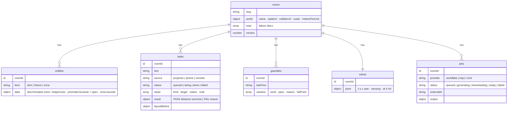

# Dry Run — Architecture

> **One sentence:** a reactive store is the single source of truth; the projector tab runs a deterministic executor over a
> World Labs collider grid; every phone is a viewer of the same store; sponsor generation is a server-side job pipeline.

- [1. System context](#1-system-context)
- [2. Runtime data flow](#2-runtime-data-flow)
- [3. A chore, end to end (sequence)](#3-a-chore-end-to-end-sequence)
- [4. Executor state machine](#4-executor-state-machine)
- [5. Planner grammar](#5-planner-grammar)
- [6. World → occupancy grid → A\*](#6-world--occupancy-grid--a)
- [7. Gauntlet (headless evaluation)](#7-gauntlet-headless-evaluation)
- [8. Store: LocalStore vs ConvexStore](#8-store-localstore-vs-convexstore)
- [9. Convex schema](#9-convex-schema)
- [10. Sponsor asset pipeline](#10-sponsor-asset-pipeline)
- [11. Module map](#11-module-map)
- [12. Invariants & gotchas](#12-invariants--gotchas)

---

## 1. System context

```mermaid
flowchart LR
  subgraph Inputs["Real world"]
    P[📷 4–8 phone photos<br/>or a text prompt]
    C[⌨️ Chore in plain English<br/>"put the blue bottle in the top drawer, then close it"]
  end

  subgraph Sponsors["Generative 3D (server-side, keys never in the browser)"]
    WL[World Labs Marble<br/>World API → .spz splat + collider.glb]
    TR[Tripo v3<br/>text→model → rig-check → rig → retarget idle/walk]
    MT[Mint MCP / REST<br/>asset pack of household props + SFX]
  end

  subgraph App["Dry Run (Vite + three 0.180 + Spark 2.0)"]
    W[World<br/>splat render · collider raycast · occupancy grid]
    PL[Planner<br/>grammar → steps · Claude fallback]
    EX[Executor<br/>A* · pick/place · open/close · pose @ 4 Hz]
    GA[Gauntlet<br/>N shuffled layouts · clutter · failure heat]
  end

  subgraph Sync["Convex (one reactive query per screen)"]
    DB[(rooms · robots · entities<br/>tasks · gauntlets · jobs)]
  end

  PR[🖥️ Projector<br/>index.html]
  PH[📱 Every phone<br/>ledger.html?room=demo]

  P --> WL --> W
  TR --> EX
  MT --> W
  C --> PL --> EX
  W --> EX --> DB
  GA --> DB
  DB <--> PR
  DB <--> PH
  PH -. submit chore .-> DB
```

## 2. Runtime data flow

**The store is the only way state changes.** Nothing mutates a `RoomState` in place; the executor, HUD tools and phones all
call `store.*` mutations, and every screen re-renders from the subscription.

```mermaid
flowchart TB
  subgraph Projector["Projector tab (the only writer of robot pose + step transitions)"]
    HUD[HUD tools<br/>+Drawer +Door +Item +Zone · Robot start · Reset · Stop]
    EXE[Executor tick(dt)<br/>sub-stepped ≤ 1/50 s]
    RV[RoomView<br/>store → three.js reconciliation<br/>locked set for in-flight manipulations]
    RB[Robot controller<br/>path follow · facing · attach/detach<br/>ProceduralBody | GltfBody]
  end

  subgraph Store["Store interface"]
    LS[LocalStore<br/>localStorage + BroadcastChannel<br/>versioned commits]
    CS[ConvexStore<br/>room.getState (big) + room.getRobot (small, 4 Hz)<br/>plan() → Claude action]
  end

  subgraph Phones["Viewers"]
    LG[ledger.html<br/>live steps · up-next queue · DPR-correct top-down map<br/>Gauntlet tiles · history]
  end

  HUD -->|addEntity / submitTask / reset| Store
  EXE -->|claimTask · setStep · setResult · setPose| Store
  Store -->|subscribe| RV --> RB
  Store -->|subscribe| LG
  LG -->|submitTask| Store
  LS <-.same interface.-> CS
```

Two queries in Convex mode on purpose: the robot heartbeat lives in its own `robots` table so 4 Hz pose updates never
re-run the big room query on every phone.

## 3. A chore, end to end (sequence)



## 4. Executor state machine



`tick(dt)` is sub-stepped at ≤ 1/50 s so motion is frame-rate independent — hidden tabs throttle `requestAnimationFrame`,
and `dryrun.fastForward(20)` in the console advances the sim 20 s without frames.

## 5. Planner grammar

Rule-based, deterministic, tested. Optional Claude (`convex/planner.ts`, `tool_choice: submit_plan`) runs first in Convex
mode; an empty or invalid LLM plan is rejected and the grammar takes over.

| Utterance pattern | Steps |
| --- | --- |
| `put/place/move/bring/take <item> on/in <zone or fixture>` | navigate → pick → navigate → [open] → place |
| `… then close it` / `and close it` | + navigate → close |
| `open/close the <fixture>` | navigate → open/close |
| `go to <zone>` | navigate |
| `fetch/get/grab/bring me <item>` | navigate → pick (robot now carrying) |
| `put it on the table` (pronoun, carry-over) | navigate → place (uses `robot.carrying`) |
| `<item A> and <item B>` (conjunction) | sequence per item |
| `all the mugs` / plurals | one sequence per matching item |
| ambiguous (`the mug` when two mugs) | FAIL: `Which one: red mug, blue mug?` |
| fixture state across clauses | `open the top drawer, put the mug in it and close it` |

## 6. World → occupancy grid → A\*



Coordinates: world units; starter world `scale` 5, `metersPerUnit` 0.4 (a 0.5-unit cell ≈ 20 cm). Yaw is rotation about
+Y, robot forward is +Z. Reach and approach factor are shared between the live executor and the headless evaluator via
`TrialConfig`, so Gauntlet verdicts match what the robot would actually do.

## 7. Gauntlet (headless evaluation)

```mermaid
flowchart TB
  T[Last chore text + current room] --> V0[Variant 0: room as-is]
  T --> VN[Variants 1..N: items shuffled to reachable cells<br/>+ random clutter boxes, seeded RNG]
  V0 & VN --> RT[runTrial: plan + simulate on the grid<br/>no rendering, milliseconds each]
  RT --> OK[PASS tile]
  RT --> KO[FAIL tile + first-failure reason<br/>findBlocker → blockerReason<br/>"blocked by clutter box 2, 0.8 m from shelf"]
  KO --> HEAT[Failure heat discs on the floor<br/>room.setHeat]
  OK & KO --> REPLAY[Click a tile → replay that layout in 3D]
```

Determinism is tested (`tests/sim.test.ts`): same seed → same layouts → same verdicts.

## 8. Store: LocalStore vs ConvexStore

| | LocalStore (offline) | ConvexStore (live) |
| --- | --- | --- |
| Persistence | `localStorage`, versioned commits | Convex tables |
| Fan-out | `BroadcastChannel` across tabs of one browser | Reactive queries to every device |
| Robot pose | in the same state blob | `robots` table, `room.getRobot` subscription |
| Planner | grammar | Claude action → grammar fallback |
| Reload mid-chore | re-queues and resumes | re-queues and resumes |
| Selected by | no `VITE_CONVEX_URL`, or `?local=1` | `VITE_CONVEX_URL` set |

Both implement one `Store` interface; `src/main.ts` and `src/ledger.ts` never know which one they have.

## 9. Convex schema



`'use node'` files (`planner.ts`, `worldlabs.ts`, `tripo.ts`, `mint.ts`) only export actions; long polls are chains of
scheduled actions; the one internal mutation they need (`room.applyWorld`) lives in `convex/room.ts`.

## 10. Sponsor asset pipeline

```mermaid
flowchart LR
  subgraph WorldLabs["World Labs (scripts/worldlabs-generate.mjs · convex/worldlabs.ts)"]
    W1[media-assets:prepare_upload + PUT photos] --> W2[worlds:generate<br/>marble-1.1 · multi-image] --> W3[operations/{id} poll 10 s] --> W4[worlds/{id}<br/>spz_urls · collider_mesh_url · metric_scale_factor]
  end
  subgraph Tripo["Tripo (scripts/tripo-robot.mjs · convex/tripo.ts)"]
    T1[text-to-model P1<br/>pbr · face_limit] --> T2[animations/rig-check] --> T3[animations/rig] --> T4[animations/retarget<br/>preset:idle · preset:walk · in place] --> T5[download within 5-min URL expiry]
  end
  subgraph Mint["Mint (docs/MINT.md · scripts/mint-sync.mjs · convex/mint.ts)"]
    M1[Claude Code + Mint MCP<br/>asset-packs:generate · audio:generate] --> M2[operations/{id}] --> M3[models/{id}.assets.glbUrl<br/>Draco GLB · audio artifacts]
  end
  W4 & T5 & M3 --> MF[public/assets/manifest.json<br/>world · robot · props[] · audio[]<br/>provider · model · ids]
  MF --> APP[App boot: load world, robot body, prop GLBs, SFX<br/>Receipts panel shows every id on screen]
```

## 11. Module map

```
index.html / ledger.html            two Vite entries (projector app, phone ledger)
src/main.ts                         boot: renderer → store → world → robot → room view → executor → HUD; click tools; Gauntlet; replay; reset
src/sim/types.ts                    Entity = Item | Fixture | Zone, Task, Step, RobotPose, Gauntlet, RoomState, AssetManifest, assetUrl()
src/sim/grid.ts                     occupancy grid, inflate, A* (8-conn, no corner cutting), lineOfSight, smoothPath, findApproachCell, seeded rng
src/sim/planner.ts                  grammar → steps; pronouns, conjunctions, plurals, ambiguity, fixture state; stepsFromLlm()
src/sim/evaluate.ts                 headless trials: gridWithEntities, makeVariantLayout, runTrial, runGauntlet, findBlocker, blockerReason
src/sim/executor.ts                 state machine (claims, plans, navigates, manipulates, writes steps/results/pose); abort(); resumeAfterReload()
src/world/world.ts                  Spark SplatMesh + collider GLB (ShadowMaterial), floor estimate, raycasts, grid rasterization
src/world/props.ts                  procedural items, prismatic drawer & revolute door views, zones, labels, heat discs; GLB props via manifest
src/robot/robot.ts                  Robot controller + ProceduralBody (2-link IK arm, LED) + GltfBody (Tripo GLB, idle/walk clips)
src/app/room.ts                     RoomView: store → three.js reconciliation, fixture animations, highlight, pickables, locked set
src/app/seed.ts · sfx.ts            seed layout on reachable cells; WebAudio synth cues (Mint audio overrides)
src/data/store.ts                   Store interface; LocalStore; ConvexStore
src/ui/hud.ts · hud.css             projector HUD; src/ledger.ts · ui/ledger.css the phone page
convex/schema.ts · room.ts · entities.ts · tasks.ts · gauntlets.ts · robot.ts · jobs.ts
convex/planner.ts · worldlabs.ts · tripo.ts · mint.ts   'use node' actions
scripts/lib.mjs · worldlabs-generate.mjs · tripo-robot.mjs · mint-sync.mjs
tests/sim.test.ts                   A*, planner grammar, Gauntlet determinism/clutter, stepsFromLlm
```

## 12. Invariants & gotchas

- **Never mutate `RoomState` in place.** Go through the store; the ledger and projector both re-render from it.
- **Only the projector writes robot pose and step transitions.** Phones submit tasks; they never drive the robot.
- **`RoomView.locked`** keeps a held item / animating fixture from being snapped back by a store re-sync.
- **Robot heartbeat is not on the `rooms` doc** — otherwise every phone re-runs the big query 4×/s.
- **Spark 2.0 pins `three@0.180.0`.** Do not bump three.
- **`startCellFor()` frees the robot's own cell** — items placed next to the robot would otherwise block it.
- **Sponsor URLs expire** (Tripo ~5 min, World Labs signed URLs): download to `public/assets/generated` / Convex storage immediately.
- **Keys are server-side only** (Convex env, shell env for `scripts/`). Nothing under `src/` or `public/` ever sees a key.
- **Deploy base:** `VITE_BASE=/dry-run/` for GitHub Pages; `assetUrl()` resolves public assets against it.
